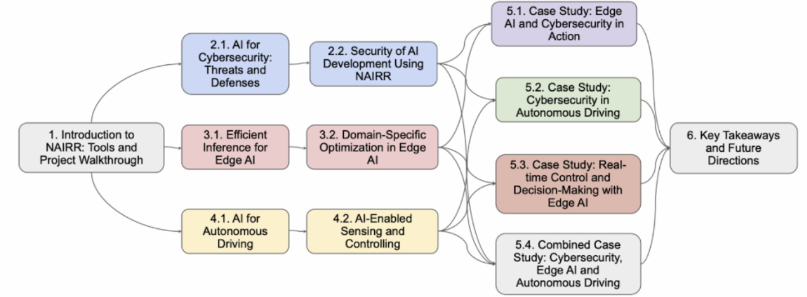

# NAIRR-Workshops



## About

This repository includes workshop materials that reference the [Workshop_EdgeAI](https://github.com/lc-leonardo/Workshop_EdgeAI) repository as submodules for different workshop sections.

## Cloning the Repository

This repository contains submodules. To clone the repository along with all submodules, use one of the following methods:

### Option 1: Clone with submodules in a single command

```bash
git clone --recurse-submodules https://github.com/Brian/NAIRR-Workshops.git
```

### Option 2: Clone first, then initialize submodules

```bash
git clone https://github.com/Brian/NAIRR-Workshops.git
cd NAIRR-Workshops
git submodule update --init --recursive
```

### Updating submodules

If you've already cloned the repository and need to update the submodules:

```bash
git submodule update --init --recursive
```