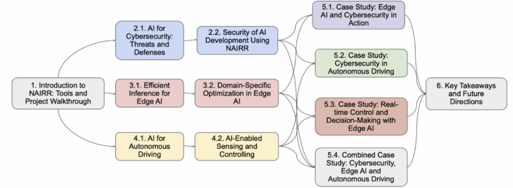

# NAIRR Workshop Series on Cybersecurity, Edge AI, and Autonomous Driving



## About

This repository contains hands-on workshop materials for the NAIRR (National AI Research Resource) program, developed by **Worcester Polytechnic Institute (WPI)** and **Oakland University (OU)**. Workshops cover AI for cybersecurity, security of AI systems, AI-enabled sensing and control, and efficient Edge AI.

This repository is maintained by the **LIONS Group** at WPI as part of the broader **CARE-AI** team.

## Team

### CARE-AI Team


### LIONS Group (Repository Maintainers)


## Getting Started

Clone the repository and open any workshop folder:

```bash
git clone https://github.com/WPI-LIONS-Group/NAIRR-Workshops.git
cd NAIRR-Workshops
```

Each workshop folder contains Jupyter notebooks and a `requirements.txt` (or equivalent) for installing dependencies. Install dependencies for a specific workshop before running its notebooks.

## Workshops

All workshops are located in the `Workshops (WS)/` directory.

### Hosted in This Repository

| Folder | Topic |
|--------|-------|
| `WS-2.1-AI_for_Cybersecurity` | Binary classification and vulnerability detection using the NSL-KDD dataset |
| `WS-2.2-Security_of_AI_Development` | Adversarial attacks, defenses, model inversion, digital watermarking, and LLM watermarking |
| `WS-4.2-AI_Enabled_Sensing_and_Controlling` | Camera sensing, LiDAR sensing, and AI-based search and planning |

### Synced from [Workshop_EdgeAI](https://github.com/lc-leonardo/Workshop_EdgeAI)

These workshops are automatically synced weekly from an external repository via GitHub Actions:

| Folder | Topic |
|--------|-------|
| `WS_3.1_Efficient_Inference_for_Edge_AI` | Quantization, pruning, and knowledge distillation |
| `WS_3.2_Domain-Specific_Optimization_in_Edge_AI` | Efficient ViT acceleration, LLM SmoothQuant, and diffusion model acceleration |
| `WS_5.1_Case_Study_Edge_AI_and_Cybersecurity_in_Action` | Network traffic analysis, edge AI anomaly detection, and stream inference |
| `WS_5.2_Case_Study_Cyber_Security_in_Autonomous_Driving` | Multimodal data fusion, edge AI for autonomous vehicles, and real-time alerting |